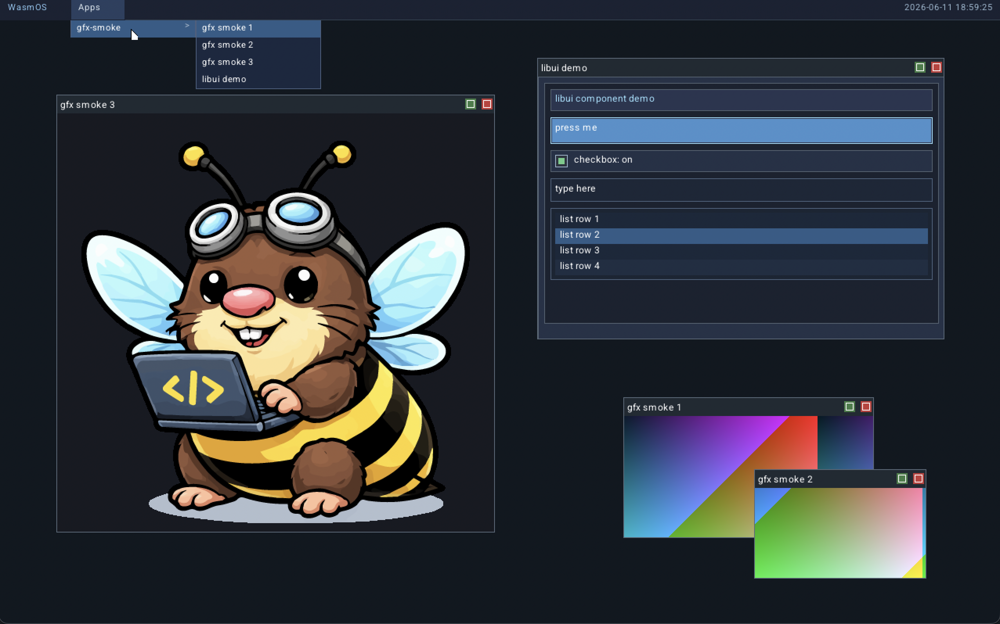

<p align="center">
  <picture>
    <source srcset="wasmos_wordmark-light.webp" type="image/webp" media="(prefers-color-scheme: light)">
    <source srcset="wasmos_wordmark-dark.webp" type="image/webp" media="(prefers-color-scheme: dark)">
    
  </picture>
</p>

<p align="center">
  <picture>
    <source srcset="wasmo.webp" type="image/webp">
    
  </picture>
</p>

<p align="center"><strong>Small boot path. Small kernel. Large mascot and agent energy.</strong></p>

WASMOS is a minimal x86_64 UEFI OS playground with a small microkernel core
and a WASM-first user-space stack (`wasm3`), plus optional native drivers for
hardware paths that benefit from native execution.

It is designed for experimentation, not production use.

For contributors and coding agents: read `AGENTS.md` before making changes.
It defines repository workflow and documentation/update conventions.

## Current Highlights
- 64-bit (`x86_64`) UEFI microkernel OS scaffold with deterministic boot handoff (`BOOTX64.EFI` -> `kernel.elf` + `initfs.img`).
- WASM-first userspace (`wasm3`) that runs apps, services, and drivers from multiple languages (C, Zig, Go, Rust, AssemblyScript), plus optional native drivers where hardware access needs it.
- Custom WASMOS-APP package format (`.wap`) for both WebAssembly and native app/service/driver payloads with shared metadata-driven loading.
- Explicit microkernel primitives: paging, scheduler, IPC, process lifecycle, capabilities with binary policy enforcement (kill on violation), and full ring-3 isolation enabled by default.
- Preemptive multitasking in the kernel scheduler with runtime validation coverage.
- Symmetric Multi-Processing (SMP) with AP trampoline bring-up, per-CPU state (`cpu_local_t`), Kconfig-selectable interrupt controller (PIC/LAPIC/IOAPIC), and a spinlock-protected shared ready queue; gated by `WASMOS_SMP` Kconfig (requires IOAPIC mode, default off).
- Service-driven system bring-up (`init` -> `fs-manager`/`fs-init` -> `device-manager` -> `sysinit`) with discovery/registration and policy-driven driver spawning.
- Linux `udev`-like userspace device inventory and policy rules (`device-manager` + `pci-bus`/`acpi-bus`, with bootstrap/runtime rule roots) for deterministic driver bring-up.
- Early generic `virtio-serial` driver service (`virtio.serial`) for host/guest automation plumbing and future transport consumers.
- Directory-based mount namespace (`/init`, `/boot`, `/user`) through `fs-manager` VFS routing across initfs and FAT-backed filesystems.
- Buffer-borrow-based DMA support integrated across capability policy, runtime transport, and driver paths.
- End-to-end threading support (`thread_create`, `thread_join`, `thread_detach`, `thread_yield`, `thread_exit`) for ring-3 workloads, with user-space reentrant mutex across WASM and native runtimes.
- Full windowing and graphics stack: framebuffer driver, software compositor, shared-buffer rendering, input routing, window chrome (title bar, close/maximize/restore, drag-to-move, live resize), software cursor, popup menus, and a system menu bar with date/time display and per-app window lists; backed by a native Zig TTF `font-service` for text rendering.
- `libui` component toolkit — vtable-dispatched widget tree (panels, labels, buttons, checkboxes, text inputs, scroll views, list views, dropdowns, and menus) shared across WASM and native ring-3 apps.
- Practical interactive environment with VT/CLI, multi-TTY switching, and scriptable boot-time userspace workflows.

<p align="center">
  <picture>
    
  </picture>
</p>

## Quick Start

### Requirements
- `clang` + `lld`
- `llvm-objcopy`
- `cmake` 3.20+
- `qemu-system-x86_64`

macOS note:
- use Homebrew LLVM (`appleclang` is not sufficient for the UEFI target)
- install with: `brew install llvm lld qemu`

### Configure
```sh
cmake -S . -B build
```

Optional Kconfig-style flow:
```sh
cmake --build build --target kconfig-defconfig
cmake --build build --target menuconfig
cmake -S . -B build
```

Notes:
- `kconfig-defconfig` seeds `build/.config` from `configs/wasmos_defconfig`.
- `menuconfig` auto-detects a frontend binary (`menuconfig`, `nconfig`,
  `kconfig-mconf`, or `mconf`); if none are found, it falls back to the repo's
  Python `kconfiglib` interactive editor.
- `kconfiglib-menuconfig` runs the Python `kconfiglib` editor directly.
- Python fallback requirement: `python3 -m pip install kconfiglib`.
- If no frontend is installed, you can still edit `build/.config` directly and
  re-run `cmake -S . -B build` to import the changes.
- Current Kconfig symbols cover the core toggles already used by CMake:
  language example switches, tracing/ring3 smoke flags, kernel target triple,
  and QEMU GDB port.
  It also includes `WASMOS_PM_TEST_HOOKS` for process-manager test injection hooks.

If tool autodiscovery fails:
```sh
cmake -S . -B build \
  -DCLANG=/path/to/llvm/bin/clang \
  -DLLD_LINK=/path/to/lld-link
```

If OVMF autodiscovery fails:
```sh
cmake -S . -B build -DOVMF_CODE=/path/to/OVMF_CODE.fd
```

Optional vars image:
```sh
cmake -S . -B build \
  -DOVMF_CODE=/path/to/OVMF_CODE.fd \
  -DOVMF_VARS=/path/to/OVMF_VARS.fd
```

### C++ Usage
- C++ is supported for higher-level kernel, driver, service, and app code.
- Low-level boot/arch/interrupt/memory-management and ABI boundary code stays C/ASM.
- WASM C++ modules are built with `-fno-exceptions -fno-rtti -fno-threadsafe-statics -fno-use-cxa-atexit`.
- Keep kernel/syscall/hostcall interfaces C ABI stable (`extern "C"` at boundaries).
- Prefer "C with classes" style and explicit ownership; avoid hidden runtime-heavy patterns.

WASM C++ app target helper:
```cmake
wasmos_add_wasm_cpp_app_target(my_cpp_app
  SOURCE ${CMAKE_SOURCE_DIR}/examples/cpp/my_app.cpp
  OUTPUT_WASM ${BUILD_DIR}/my_app.wasm
  OUTPUT_APP ${BUILD_DIR}/my_app.wap
  MANIFEST ${CMAKE_SOURCE_DIR}/examples/cpp/my_app.manifest.toml
  EXPORT wasmos_main
)
```

### Build
```sh
cmake --build build --target bootloader
cmake --build build --target kernel
cmake --build build --target make_wasmos_app
```

### Run
```sh
cmake --build build --target run-qemu
cmake --build build --target run-qemu-debug
cmake --build build --target run-qemu-ui-test
```

### Test
```sh
cmake --build build --target run-kernel-unit-tests
cmake --build build --target run-qemu-test
cmake --build build --target run-qemu-cli-test
cmake --build build --target run-qemu-ring3-test
cmake --build build --target run-qemu-ring3-threading-test
```

Target summary:
- `run-qemu`: normal boot in QEMU
- `run-qemu-debug`: paused boot for GDB attach
- `run-qemu-test`: compile + boot + halt smoke
- `run-qemu-cli-test`: CLI integration suite
- `run-qemu-ring3-test`: strict ring-3 smoke path (includes PM owner-deny test-hook marker checks)
- `run-qemu-ring3-threading-test`: opt-in strict ring-3 threading smoke (ring3-threading spawn + ring3 thread `create`/`join`/`detach` syscall markers including detach-then-join deny + wait/kill wake marker)

## Startup Model
Boot sequence (high level):
1. `BOOTX64.EFI` loads `kernel.elf` and `initfs.img`
2. Kernel boots, initializes core subsystems, starts `init`
3. `init` starts `fs-manager`, then `fs-init`, then `device-manager`
4. `device-manager` starts `pci-bus` and `acpi-bus`, consumes inventory, and applies policy rules to spawn drivers/services
5. Storage drivers publish block devices; `fs-fat` mounts `/boot` (and optional `/user`), then runtime policy from `/boot/system/devmgr/rules` is loaded
6. `init` requests `sysinit` from `/boot`, and `sysinit` starts configured services/apps

Key policy/runtime notes:
- Driver matching is metadata-driven (`linker.metadata` in WASMOS-APP packages) and resolved through process-manager module metadata queries.
- `fs-manager` is the canonical VFS endpoint (`fs.vfs`) and routes `/init`, `/boot`, and `/user` mounts.
- `device-manager` rules are split between bootstrap (`/init/devmgr/rules`) and runtime override (`/boot/system/devmgr/rules`).

## Repository Layout
- `src/boot/`: UEFI bootloader
- `src/kernel/`: kernel core
- `src/drivers/`: drivers (WASM and native)
- `src/services/`: services
- `src/utils/`: OS-provided utilities/tools
- `src/libc/`: shared user-space libc + shims
- `examples/`: sample/smoke apps
- `userfs/`: host-backed user filesystem directory attached as a second FAT drive in QEMU
- `scripts/initfs/devmgr/rules/`: bootstrap device-manager rules packaged into initfs at `/init/devmgr/rules`
- `scripts/system/devmgr/rules/`: runtime override rules copied to ESP at `/boot/system/devmgr/rules`
- `tests/`: QEMU-driven tests
- `scripts/`: build/test helpers
- `docs/`: architecture/design docs

## Documentation Index
- `docs/ARCHITECTURE.md`: architecture index
- `docs/BUILD_SYSTEM.md`: CMake build system — target types, helper functions, app types, QEMU targets, and how to add new components
- `docs/architecture/`: feature-level architecture docs
- `docs/architecture/11-ring3-isolation-and-separation.md`: ring-3 isolation and kernel/user-space separation design
- `docs/architecture/08-threading-and-lifecycle.md`: threading design and rollout
- `docs/architecture/12-dma-transfers.md`: DMA transfer capability model, phased rollout plan, and validation gates
- `docs/architecture/20-graphics-framebuffer-and-compositor.md`: microkernel graphics stack design (framebuffer driver, shared-buffer IPC model, compositor ABI, and phased implementation plan)
- `docs/architecture/24-environment-scopes-and-inheritance.md`: environment scope model for CLI/scripts/processes, POSIX-like inheritance semantics, and `script` vs `source` behavior
- `docs/architecture/21-virtual-input-testing-via-virtio-serial.md`: testing-focused virtual input (mouse + keyboard) design over `virtio-serial`, including protocol, host bridge, and Python test harness integration
- `docs/architecture/22-networking-virtio-net-and-stack.md`: staged networking design for explicit QEMU NIC config, `virtio-net` transport driver, and user-space TCP/UDP stack service boundaries
- `docs/TASKS.md`: active and planned work
- `AGENTS.md`: contributor/agent workflow and repository rules

## Runtime Model (Brief)
- Runtime host: `wasm3`
- Process manager loads WASMOS-APP payloads
- Payloads can be WASM apps/services or native driver payloads

For the complete ABI/runtime contract and subsystem details, use the
architecture docs under `docs/architecture/`.
