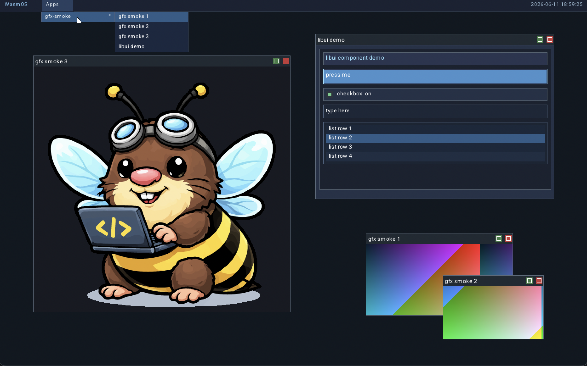

<p align="center">
  <picture>
    <source srcset="wasmos_wordmark-light.webp" type="image/webp" media="(prefers-color-scheme: light)">
    <source srcset="wasmos_wordmark-dark.webp" type="image/webp" media="(prefers-color-scheme: dark)">
    
  </picture>
</p>

<p align="center">
  <picture>
    <source srcset="wasmo.webp" type="image/webp">
    
  </picture>
</p>

<p align="center"><strong>Small boot path. Small kernel. Large mascot and agent energy.</strong></p>

WASMOS is a minimal x86_64 UEFI OS playground with a small microkernel core
and a WASM-first user-space stack, plus optional native drivers for hardware
paths that benefit from native execution.

Two WASM runtime backends are available (select at build time):
- **WARP** (default) — single-pass JIT compiler (BMW AG, Apache-2.0),
  near-native execution speed on x86_64. Its guests execute in ring 3 and are
  preempted like any other thread.
- **wasm3** — tree-walking interpreter, pure C, minimal footprint. Runs in the
  kernel, so a guest loop that makes no host call is not preempted; useful as a
  compact reference backend rather than for interactive workloads.
  WARP-loaded services, drivers, and utilities execute through the ring-3
  isolation path, with kernel-managed hostcall and linear-memory trampolines.

It is designed for experimentation, not production use.

For contributors and coding agents: read `AGENTS.md` before making changes.
It defines repository workflow and documentation/update conventions.

## Current Highlights
- 64-bit (`x86_64`) UEFI microkernel OS scaffold with deterministic boot handoff (`BOOTX64.EFI` -> `kernel.elf` + `initfs.img`).
- WASM-first userspace (`wasm3`) that runs apps, services, and drivers from multiple languages (C, Zig, Go, Rust, AssemblyScript), plus optional native drivers where hardware access needs it.
- Custom WASMOS-APP package format (`.wap`) for both WebAssembly and native app/service/driver payloads, including an 8-byte subsystem tag for runtime dispatch plus broker-registered executable handler plumbing for future non-`.wap` executable formats.
- Explicit microkernel primitives: paging, scheduler, IPC, process lifecycle, capabilities with binary policy enforcement (kill on violation), and full ring-3 isolation enabled by default.
- Kernel panic diagnostics with per-CPU backtraces that now resolve return addresses to in-kernel symbol names.
- Preemptive multitasking in the kernel scheduler with runtime validation coverage.
- Symmetric Multi-Processing (SMP) with AP trampoline bring-up, per-CPU state (`cpu_local_t`), Kconfig-selectable interrupt controller (PIC/LAPIC/IOAPIC), and per-CPU ready queues with work stealing; gated by `WASMOS_SMP` Kconfig (requires IOAPIC mode, default off).
- Service-driven system bring-up (`init` -> `fs-manager`/`fs-init` -> `device-manager` -> `sysinit`) with discovery/registration and policy-driven driver spawning.
- Linux `udev`-like userspace device inventory and policy rules (`device-manager` + `pci-bus`/`acpi-bus`, with bootstrap/runtime rule roots) for deterministic driver bring-up.
- Early generic `virtio-serial` driver service (`virtio.serial`) for host/guest automation plumbing and future transport consumers.
- `virtio-rng` hardware entropy driver with non-blocking `libsys` byte-array,
  integer, and unit-interval float helpers for WASM and native clients.
- `virtio-blk` block-device driver, written in Zig, serving the block IPC
  interface over a virtqueue whose data descriptor addresses the caller's own
  buffer directly.
- Networking stack: `virtio-net` transport driver plus a native lwIP `net-stack`
  service providing IPv4 UDP/TCP stream sockets, DHCP/static addressing, DNS
  resolution, and a verifying TLS 1.2 client (mbedTLS, full chain + hostname
  verification), with `curl`, `host`, and `ip` user-space tools.
- Directory-based mount namespace (`/init`, `/boot`, `/user`) through `fs-manager` VFS routing across initfs and FAT-backed filesystems.
- Buffer-borrow-based DMA support integrated across capability policy, runtime transport, and driver paths.
- End-to-end threading for ring-3 **native** workloads (create/join/detach/yield/exit syscalls), with a user-space reentrant mutex shared by the native and WASM runtimes. WASM guests get concurrency through coroutines and futures instead of threads.
- User-space coroutine/future/promise runtime across both runtimes (native stackful, WASM stackless) with caller-owned storage, cooperative scheduling, `then`/`race`/`all` combinators, and joins; it underpins the asynchronous networking stack.
- Full windowing and graphics stack: framebuffer driver, software compositor, shared-buffer rendering, input routing, window chrome (title bar, close/maximize/restore, drag-to-move, live resize), software cursor, popup menus, and a system menu bar with date/time display and per-app window lists; backed by a native Zig TTF `font-service` for text rendering.
- `libui` component toolkit — vtable-dispatched widget tree (panels, labels, buttons, checkboxes, text inputs, scroll views, list views, dropdowns, and menus) shared across WASM and native ring-3 apps.
- Practical interactive environment with VT/CLI, multi-TTY switching, and scriptable boot-time userspace workflows.
- Broker-oriented runtime direction: `.wap` remains the built-in executable container while future subsystems can claim extra executable formats through bounded matcher trees (for example extension, magic-prefix, or shebang-style probes).
- Path-based executable lookup now classifies valid `.wap` blobs first, can synchronously ask a broker-owned external format handler for a spawn plan, and can then launch a validated broker-returned `.wap` host path through the normal PM path flow.

<p align="center">
  
</p>

## Quick Start

### Requirements
- `clang` + `lld`
- `llvm-objcopy`
- `cmake` 3.20+
- `qemu-system-x86_64`

macOS note:
- use Homebrew LLVM (`appleclang` is not sufficient for the UEFI target)
- install with: `brew install llvm lld qemu`

### Configure

Pick the configuration the build directory should use. Each defconfig in
`configs/` selects a WASM runtime and a CPU topology, and the choice is fixed
for the lifetime of that directory:

```sh
cmake -S . -B build -DWASMOS_DOTCONFIG=configs/warp_smp_defconfig
```

Without `-DWASMOS_DOTCONFIG` the shared base `configs/wasmos_defconfig` applies,
which selects no runtime and so leaves the default:

```sh
cmake -S . -B build
```

#### Choosing a WASM runtime

| defconfig                | runtime | CPUs   |
|--------------------------|---------|--------|
| `wasm3_single_defconfig` | wasm3   | single |
| `wasm3_smp_defconfig`    | wasm3   | SMP    |
| `warp_single_defconfig`  | WARP    | single |
| `warp_smp_defconfig`     | WARP    | SMP    |

Give each configuration its own directory, so switching does not mean
reconfiguring:

```sh
cmake -S . -B build-warp-smp  -DWASMOS_DOTCONFIG=configs/warp_smp_defconfig
cmake -S . -B build-wasm3-smp -DWASMOS_DOTCONFIG=configs/wasm3_smp_defconfig
cmake --build build-warp-smp --target run-qemu-test
```

or via the helper, which derives the build directory from the config name:

```sh
scripts/run_config.sh warp_smp                # boot WARP + SMP to the CLI
scripts/run_config.sh wasm3_smp               # boot wasm3 + SMP
scripts/run_config.sh wasm3_single kernel     # just build the kernel
```

The chosen config is copied to `<build-dir>/.config` on first configure and that
copy is authoritative afterwards, so directories cannot influence one another;
delete it to re-seed, or run the `kconfig-defconfig` target to restore it.
`-DWASMOS_WASM_RUNTIME_*` flags are not a reliable way to select the runtime,
because the imported config is applied after them — use a defconfig.

Optional Kconfig-style flow:
```sh
cmake --build build --target kconfig-defconfig
cmake --build build --target menuconfig
cmake -S . -B build
```

Notes:
- `kconfig-defconfig` restores `<build-dir>/.config` from the defconfig that
  directory was configured with (`configs/wasmos_defconfig` if none was given).
- `menuconfig` auto-detects a frontend binary (`menuconfig`, `nconfig`,
  `kconfig-mconf`, or `mconf`); if none are found, it falls back to the repo's
  Python `kconfiglib` interactive editor.
- `kconfiglib-menuconfig` runs the Python `kconfiglib` editor directly.
- Python fallback requirement: `python3 -m pip install kconfiglib`.
- If no frontend is installed, you can still edit `build/.config` directly and
  re-run `cmake -S . -B build` to import the changes.
- Current Kconfig symbols cover the core toggles already used by CMake:
  language example switches, tracing/ring3 smoke flags, kernel target triple,
  and QEMU GDB port.
  It also includes `WASMOS_PM_TEST_HOOKS` for process-manager test injection hooks.

If tool autodiscovery fails:
```sh
cmake -S . -B build \
  -DCLANG=/path/to/llvm/bin/clang \
  -DLLD_LINK=/path/to/lld-link
```

If OVMF autodiscovery fails:
```sh
cmake -S . -B build -DOVMF_CODE=/path/to/OVMF_CODE.fd
```

Optional vars image:
```sh
cmake -S . -B build \
  -DOVMF_CODE=/path/to/OVMF_CODE.fd \
  -DOVMF_VARS=/path/to/OVMF_VARS.fd
```

### C++ Usage
- C++ is supported for higher-level kernel, driver, service, and app code.
- Low-level boot/arch/interrupt/memory-management and ABI boundary code stays C/ASM.
- WASM C++ modules are built with `-fno-exceptions -fno-rtti -fno-threadsafe-statics -fno-use-cxa-atexit`.
- Keep kernel/syscall/hostcall interfaces C ABI stable (`extern "C"` at boundaries).
- Prefer "C with classes" style and explicit ownership; avoid hidden runtime-heavy patterns.

WASM C++ app target helper:
```cmake
wasmos_add_wasm_cpp_app_target(my_cpp_app
  SOURCE ${CMAKE_SOURCE_DIR}/examples/cpp/my_app.cpp
  OUTPUT_WASM ${BUILD_DIR}/my_app.wasm
  OUTPUT_APP ${BUILD_DIR}/my_app.wap
  MANIFEST ${CMAKE_SOURCE_DIR}/examples/cpp/my_app.manifest.toml
  EXPORT wasmos_main
)
```

### Build
```sh
cmake --build build --target bootloader
cmake --build build --target kernel
cmake --build build --target make_wasmos_app
```

### Run
```sh
cmake --build build --target run-qemu
cmake --build build --target run-qemu-debug
cmake --build build --target run-qemu-ui-test
```

### Test
```sh
cmake --build build --target run-kernel-unit-tests
cmake --build build --target run-qemu-test
cmake --build build --target run-qemu-cli-test
cmake --build build --target run-qemu-ring3-test
cmake --build build --target run-qemu-ring3-threading-test
```

### Developer Quality Targets
```sh
cmake --build build --target fmt        # format in-scope sources in place
cmake --build build --target fmt-check  # report formatting drift, no writes
cmake --build build --target lint       # clang-tidy + per-language checks
cmake --build build --target quality    # fmt then lint
```

Notes:
- CMake discovers the toolchain during configure and passes the resolved
  `clang-format` / `clang-tidy` / `zig` / `gofmt` / `go` / `rustfmt` / `rustc` /
  `asc` / `black` / `ruff` paths to `scripts/quality.sh`; tools it cannot find
  fall back to `PATH`. Each language is only required if it has in-scope sources.
- `lint` uses `build/compile_commands.json`, exported automatically by a normal
  `cmake -S . -B build` configure.
- Scope is limited to first-party sources under `src/`, `tests/`, `examples/`,
  and `scripts/` (edit `allowed_roots` in `scripts/quality.sh`); vendored trees
  under `libs/`, dot-folders, and `others/` are never touched.
- `asc` (AssemblyScript) usually comes from `npm install`.

Kernel panic address decoding:
```sh
python3 scripts/decode_kernel_panic.py /path/to/panic.log
```
It resolves `rip=` and `ret=` addresses against `build/kernel.elf` with
`llvm-addr2line`, so panic logs can be mapped back to source locations without
embedding DWARF readers in the kernel.

Target summary:
- `run-qemu`: normal boot in QEMU
- `run-qemu-debug`: paused boot for GDB attach
- `run-qemu-test`: compile + boot + halt smoke
- `run-qemu-cli-test`: CLI integration suite
- `run-qemu-ring3-test`: strict ring-3 smoke path (includes PM owner-deny test-hook marker checks)
- `run-qemu-ring3-threading-test`: opt-in strict ring-3 threading smoke (ring3-threading spawn + ring3 thread `create`/`join`/`detach` syscall markers including detach-then-join deny + wait/kill wake marker)

## Startup Model
Boot sequence (high level):
1. `BOOTX64.EFI` loads `kernel.elf` and `initfs.img`
2. Kernel boots, initializes core subsystems, starts `init`
3. `init` starts `fs-manager`, then `fs-init`, then `device-manager`
4. `device-manager` starts `pci-bus` and `acpi-bus`, consumes inventory, and applies policy rules to spawn drivers/services
5. Storage drivers publish block devices; `fs-fat` mounts `/boot` (and optional `/user`), then runtime policy from `/boot/system/devmgr/rules` is loaded
6. `init` requests `sysinit` from `/boot`, and `sysinit` starts configured services/apps

Key policy/runtime notes:
- Driver matching is metadata-driven (`linker.metadata` in WASMOS-APP packages) and resolved through process-manager module metadata queries.
- `fs-manager` is the canonical VFS endpoint (`fs.vfs`) and routes `/init`, `/boot`, and `/user` mounts.
- `device-manager` rules are split between bootstrap (`/init/devmgr/rules`) and runtime override (`/boot/system/devmgr/rules`).

## Repository Layout
- `src/boot/`: UEFI bootloader
- `src/kernel/`: kernel core
- `src/drivers/`: drivers (WASM and native)
- `src/services/`: services
- `src/utils/`: OS-provided utilities/tools
- `src/libc/`: shared user-space libc + shims
- `examples/`: sample/smoke apps
- `userfs/`: host-backed user filesystem directory attached as a second FAT drive in QEMU
- `scripts/initfs/devmgr/rules/`: bootstrap device-manager rules packaged into initfs at `/init/devmgr/rules`
- `scripts/system/devmgr/rules/`: runtime override rules copied to ESP at `/boot/system/devmgr/rules`
- `tests/`: QEMU-driven tests
- `scripts/`: build/test helpers
- `docs/`: architecture/design docs

## Documentation Index
- `docs/ARCHITECTURE.md`: architecture index
- `docs/BUILD_SYSTEM.md`: CMake build system — target types, helper functions, app types, QEMU targets, and how to add new components
- `docs/toolchain.md`: the `wasmos-clang` SDK — building a WASMOS application from plain C/C++ with no target triple, sysroot, linker flag or packaging step to state
- `docs/architecture/`: feature-level architecture docs
- `docs/architecture/11-ring3-isolation-and-separation.md`: ring-3 isolation and kernel/user-space separation design
- `docs/architecture/08-threading-and-lifecycle.md`: threading design and rollout
- `docs/architecture/12-dma-transfers.md`: DMA transfer capability model, phased rollout plan, and validation gates
- `docs/architecture/20-graphics-framebuffer-and-compositor.md`: microkernel graphics stack design (framebuffer driver, shared-buffer IPC model, compositor ABI, and phased implementation plan)
- `docs/architecture/24-environment-scopes-and-inheritance.md`: environment scope model for CLI/scripts/processes, POSIX-like inheritance semantics, and `script` vs `source` behavior
- `docs/architecture/21-virtual-input-testing-via-virtio-serial.md`: testing-focused virtual input (mouse + keyboard) design over `virtio-serial`, including protocol, host bridge, and Python test harness integration
- `docs/architecture/22-networking-virtio-net-and-stack.md`: staged networking design for explicit QEMU NIC config, `virtio-net` transport driver, and user-space TCP/UDP stack service boundaries
- `docs/architecture/33-completion-ports.md`: proposed kernel-owned completion queues for batched asynchronous operation results
- `docs/TASKS.md`: active and planned work
- `AGENTS.md`: contributor/agent workflow and repository rules

## WASM Runtime Backends

Two backends are available, selected at CMake configure time:

| Backend        | Pin with                                          | Character                                          |
|----------------|---------------------------------------------------|----------------------------------------------------|
| WARP (default) | `-DWASMOS_DOTCONFIG=configs/warp_smp_defconfig`   | Single-pass x86_64 JIT, ring-3 guests, preemptible |
| wasm3          | `-DWASMOS_DOTCONFIG=configs/wasm3_smp_defconfig`  | Tree-walking interpreter, in-kernel, not preempted |

The default is WARP.

To build and run with WARP:
```sh
cmake -S . -B build -DWASMOS_WASM_RUNTIME_WARP=ON
cmake --build build --target run-qemu-test
```

## Running with Real Networking

When running with real networking, QEMU needs to be configured accordingly. On macOS, you need to use the vmnet adapter
and specify the network interface name for the `-netdev vmnet-bridged` option. The interface name depends on your system
configuration.

On Linux, you need to use the `tap` adapter and specify the network interface name for the `-netdev tap` option. The
interface name depends on your system configuration.

| Goal                                                             | Value                                           | Notes                                              |
|------------------------------------------------------------------|-------------------------------------------------|----------------------------------------------------|
| Bridged networking on macOS (DHCP via router)                    | vmnet-bridged,id=net0,ifname=en0                | `en0`=Wi‑Fi, `en1`/`en5`=Ethernet — check ifconfig |
| macOS-managed NAT + its own DHCP (isolated subnet, has internet) | vmnet-shared,id=net0                            | no interface specification required                |
| Linux                                                            | tap,id=net0,ifname=tap0,script=no,downscript=no | `tap0` needs to be configured upfront              |
 
```sh
sudo qemu-system-x86_64 -m 512M -serial mon:stdio \
  -drive if=pflash,format=raw,readonly=on,file=/opt/homebrew/share/qemu/edk2-x86_64-code.fd \
  -nographic \
  -drive format=raw,file=fat:rw:build/esp \
  -drive format=raw,file=fat:rw:/Volumes/git/wasmos/userfs \
  -netdev vmnet-bridged,id=net0,ifname=en0 \ # depends on your operating system
  -device virtio-net-pci,netdev=net0,id=nic0 \
  -device virtio-rng-pci
```

## Runtime Model (Brief)
- Process manager loads WASMOS-APP payloads
- Payloads can be WASM apps/services or native driver payloads
- Each process gets its own isolated runtime instance (interpreter or JIT module)

For the complete ABI/runtime contract and subsystem details, use the
architecture docs under `docs/architecture/`.
