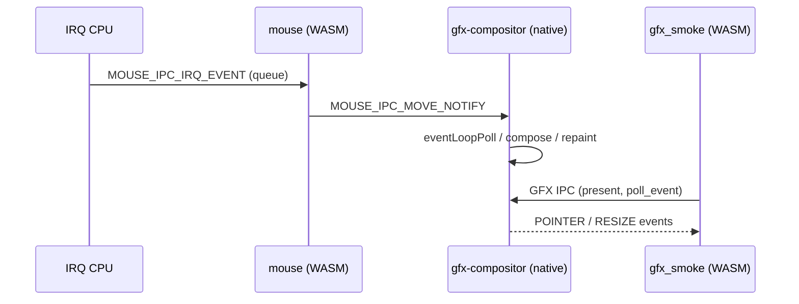

# SMP Hang Analysis (4-Core)

Investigation of intermittent partial freezes under `WASMOS_SMP=1` (4 CPUs). Symptoms include hangs during fast mouse movement in `gfx_smoke`, ACPI bus waits, gfx_smoke spawn, and CLI typing — with serial CLI sometimes still responsive.

**Scope:** repository code excluding `others/*`. Analysis date: 2026-06-10.

---

## Executive Summary

| Priority | Issue | Symptom match |
|----------|-------|---------------|
| **P0** | `cpu_sched_enqueue()` **permanently halts a CPU** if any CPU still has the thread as `current_thread` | Partial hang; other CPUs (e.g. serial CLI) may keep working |
| **P1** | `process_schedule_once_impl()` **drops threads off the ready queue** when `state != READY` without re-enqueueing | Threads permanently blocked; system looks dead except idle |
| **P2** | Wakes via `process_wake_waiters()` / `process_wake_thread_joiner()` **lack `blocking_transition` deferral** | Hangs during spawn/wait/join under SMP |
| **P3** | IRQ → IPC flood can fill 32-deep endpoint queues; masked IRQ + dropped events | Input/UI stalls (often partial, not full OS death) |

The strongest explanation for **random, partial, IPC-correlated SMP hangs** is a **scheduler wake/enqueue race**, not a single application bug in `gfx_smoke`. The system uses a **global ready queue + cross-CPU IPC wakes**. Mouse movement, keyboard typing, compositor traffic, and spawn/sync IPC all increase cross-CPU wake frequency and make these races much more likely.

---

## P0: Fatal "Enqueue Current Thread" Trap (Most Likely)

Recent SMP hardening added an intentional kill switch in `cpu_sched_enqueue()` (`src/kernel/sched_thread.c`):

```c
for (uint32_t i = 0; i < WASMOS_MAX_CPUS; ++i) {
    if (g_cpus[i].current_thread == t) {
        serial_printf_unlocked("[sched] enqueue current tid=...");
        for (;;) {
            __asm__ volatile("cli; hlt");
        }
    }
}
```

Any cross-CPU wake that calls `sched_enqueue_thread()` while the target is still `current_thread` on another CPU will **freeze that CPU forever** (`cli; hlt`).

### Why Mouse / CLI / Gfx Make This Worse

Every IPC send wakes a receiver (`src/kernel/ipc.c`):

```c
spinlock_lock(&ep->event.lock);
sched_event_wake_one(&ep->event, 0, SCHED_PEND_OK);
spinlock_unlock(&ep->event.lock);
```

Under 4 cores with high message rates (mouse → compositor, keyboard → VT → CLI, gfx_smoke ↔ compositor, device-manager ↔ PM), **sender CPU and receiver CPU are often different**.

### Intended Mitigation vs. Gap

`sched_wake_thread()` defers enqueue when `blocking_transition == 1`:

```c
if (__atomic_load_n(&t->blocking_transition, __ATOMIC_ACQUIRE)) {
    t->state = THREAD_STATE_READY;
    t->block_reason = THREAD_BLOCK_NONE;
    return;
}
```

`sched_event_wait()` sets that flag before yielding. This covers the main **`ipc_recv` / `ipc_select_wait` blocking path** used by mouse, compositor poll loops, device-manager, CLI services, etc.

**But several wake paths bypass `blocking_transition` and call `sched_enqueue_thread()` directly:**

- `process_wake_waiters()` (`src/kernel/process.c`)
- `process_wake_thread_joiner()` (`src/kernel/process.c`)
- `process_preempt_from_irq()` — ring-3 preemption only (`src/kernel/process.c`)

### Dangerous Window: `process_set_blocked()` → `process_yield()` Without `blocking_transition`

`WASMOS_SYSCALL_WAIT` (`src/kernel/syscall.c`):

```c
for (;;) {
    wait_rc = process_wait(proc, target_pid, &exit_status);
    ...
    process_yield(PROCESS_RUN_BLOCKED);
}
```

`process_wait()` only sets `BLOCKED`; it does **not** set `blocking_transition` or register on a `sched_event`:

```c
process_set_blocked(process, thread, PROCESS_BLOCK_WAIT, THREAD_BLOCK_WAIT_PROCESS);
return 1;
```

If a child exits on **another CPU** during the gap between `set_blocked` and `yield`, `process_wake_waiters()` can call `sched_enqueue_thread(waiter)` while `waiter` is still `current_thread` on its CPU → **waker CPU halts**.

Same pattern for `process_thread_join()` + `process_wake_thread_joiner()`.

This matches:

- Hang while waiting on ACPI bus / spawn paths (sync PM waits)
- Intermittent CLI/gfx stalls when spawn/wait/join overlaps input load
- **Partial** failure (one CPU dead, others alive)

### Serial Diagnostic

If this is hitting, look for:

```text
[sched] enqueue current tid=... owner=... caller_cpu=... holder_cpu=...
```

right before a CPU goes silent.

---

## P1: Stranded Threads (Silent Permanent Block)

After dequeuing from the global ready queue, the scheduler **discards** threads whose state is not `READY` (`src/kernel/process.c`):

```c
thread_t *thread = cpu_sched_pick_next(cs);
...
if (thread->state != THREAD_STATE_READY) {
    return 1;
}
```

There is **no re-enqueue**. If a `BLOCKED` or `RUNNING` thread is incorrectly on the ready queue, it is removed and never scheduled again.

`cpu_sched_enqueue()` does not verify state — only that `sched_node` is detached:

```c
if (!list_head_empty(&t->sched_node)) {
    spinlock_unlock(&cs->lock);
    return;
}
list_head_add_tail(&cs->ready_list[prio], &t->sched_node);
```

A failed wake/enqueue race (e.g. `blocking_transition` cleared, state still `BLOCKED`, no enqueue) can leave a thread **blocked forever with messages already in its IPC queue** — a scheduler-level lost wakeup.

This can affect **any** service, not just graphics.

---

## P2: Input Flood Path (Gfx + Mouse + CLI)

Amplifies P0/P1 races; rarely the sole root cause.

### Data Flow Under Fast Mouse



- **Mouse driver** blocks on `ipc_recv` (blocking path, `blocking_transition` OK).
- **Compositor** uses non-blocking `eventLoopPoll` + `sched_yield` on idle; under flood it can run long bursts without yielding.
- **IRQ handler** masks the line and sends IPC; if the endpoint queue is full (`IPC_QUEUE_DEPTH = 32`), `ipc_send_from` fails silently — input can stall but usually not whole-OS death.

Compositor `ipc_call_budgeted` has a total poll cap to avoid spinning forever during mouse floods — that can make **gfx_smoke** misbehave, but should not freeze the kernel.

### WASM Execution Model

Normal WASM services run in **ring 0** via wasm3 in `process_trampoline`. `process_preempt_from_irq()` bails out for kernel frames (`cs & 3 == 0`), so timer preemption does not hit the main WASM interpreter loop. Hangs are therefore **scheduler/IPC wake bugs**, not primarily preempted WASM bytecode.

---

## P3: Other Contributing Factors (Lower Confidence)

| Factor | Notes |
|--------|-------|
| Global `g_high_prio_streak` / `g_last_dispatched_prio` in `sched_thread.c` | Shared across CPUs without locking — unfair scheduling, not usually total hang |
| `wasm3_lock` held across blocking `ipc_recv` | Per-process; blocks re-entry on same process, not cross-process |
| Global ready-queue spinlock contention | Under extreme IPC, latency spikes can look like hangs |
| `g_in_context_switch` per-CPU | Fixed in current tree; unlikely primary cause |

---

## Symptom Correlation

| Observation | Explanation |
|-------------|-------------|
| Fast mouse makes it worse | Maximizes cross-CPU IPC wakes (mouse, compositor, gfx_smoke, font, fb) |
| Hang during ACPI wait / gfx_smoke spawn | Sync PM/device-manager waits + `process_wake_waiters` without `blocking_transition` |
| CLI typing can hang | Keyboard → VT → CLI IPC chain, same wake machinery |
| Serial CLI sometimes still works | One or more CPUs halted/stranded; VT/CLI may live on surviving CPUs |
| Feels like lock or lost reply | CPU halt in enqueue, or thread off ready queue with IPC reply already delivered |

---

## Recommended Fix Direction

### 1. Fix `cpu_sched_enqueue()` (P0)

Replace the `cli; hlt` trap with safe behavior:

- If `t` is `current_thread` on any CPU: **skip enqueue** (running CPU will re-queue on yield/block completion), or
- Treat like `blocking_transition`: mark `READY`, defer enqueue to the yielding CPU's `PROCESS_RUN_BLOCKED` / `YIELD` completion path.

The halt was useful for debugging; it is lethal under production SMP IPC load.

### 2. Unify Blocking on `sched_event_wait()` (P2)

Migrate `process_wait`, `process_thread_join`, and similar paths to use `sched_event_wait()` (or set `blocking_transition` + the same deferral rules) so **all** cross-CPU wakes share one mechanism.

### 3. Re-enqueue or Panic on Bad Dequeue (P1)

In `process_schedule_once_impl()`, if a dequeued thread is not `READY`:

- Re-enqueue if it should still be runnable, or
- Log + invariant panic with tid/pid/state — never silently drop.

### 4. Diagnostics (Confirm Before/After Fix)

- Watch serial for `[sched] enqueue current tid=`
- Watch for `[watchdog] resched stall` (stuck RUNNING thread in `process.c`)
- QEMU: `-no-reboot -d int,cpu_reset -D /tmp/qemu.log` to see which CPU stops taking timer IRQs
- GDB on all CPUs: check each AP stuck in `hlt` inside `cpu_sched_enqueue`

---

## Key Source Locations

| Component | Path |
|-----------|------|
| Enqueue halt trap | `src/kernel/sched_thread.c` — `cpu_sched_enqueue()`, `sched_enqueue_thread_from()` |
| Wake deferral | `src/kernel/sched_thread.c` — `sched_wake_thread()` |
| Blocking primitive | `src/kernel/sched_event.c` — `sched_event_wait()` |
| Dequeue drop | `src/kernel/process.c` — `process_schedule_once_impl()` |
| Wait/join wake | `src/kernel/process.c` — `process_wake_waiters()`, `process_wake_thread_joiner()` |
| IPC wake | `src/kernel/ipc.c` — `ipc_send_from()`, `ipc_recv_blocking_for()` |
| IRQ → IPC | `src/kernel/arch/x86_64/irq_x86_64.c` — `x86_irq_handler()` |
| Compositor loop | `src/services/gfx_compositor/gfx_compositor.zig` |
| Mouse driver | `src/drivers/mouse/mouse.ts` |

---

## Bottom Line

The strongest explanation for random, partial, IPC-correlated SMP hangs:

1. **Cross-CPU IPC wake tries to enqueue a thread that is still `current_thread` on another CPU → that CPU dies in `cpu_sched_enqueue`.**
2. **Secondary: threads dropped from the ready queue when `state != READY` → permanent block.**

Mouse/gfx/CLI/spawn scenarios raise cross-CPU IPC frequency and make the race surface often; they are triggers, not the root defect.